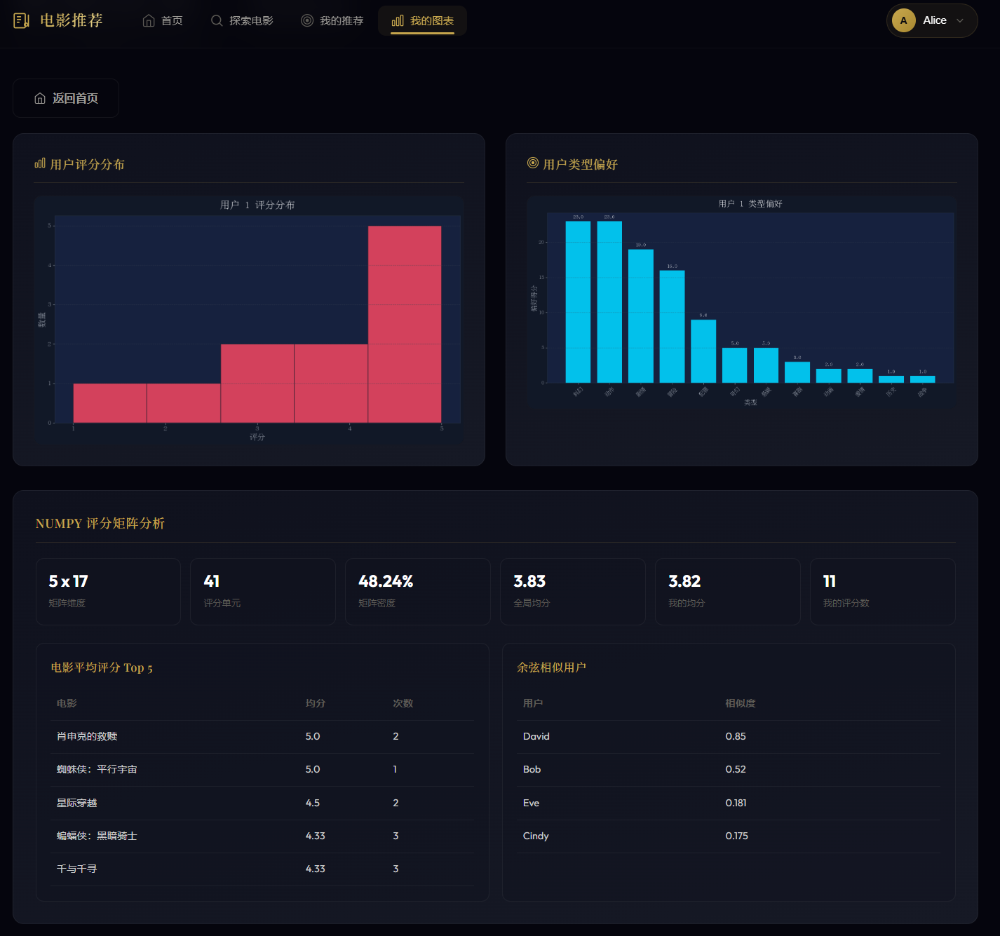

# Movie Recommender - 电影数据分析与推荐系统

## 项目简介

基于 Python 的电影推荐系统，使用协同过滤算法为用户提供个性化电影推荐。数据来源于 TMDB API，支持本地 SQLite 存储。

## 功能列表

- 从 TMDB API 爬取电影数据（或使用内置示例数据）
- SQLite 数据库存储电影、用户、评分数据
- 基于类型偏好的推荐算法
- 基于余弦相似度的协同过滤推荐算法
- numpy 评分矩阵分析（平均分、评分次数、用户相似度矩阵）
- matplotlib 数据可视化（评分分布、类型偏好）
- Flask Web 界面展示

## 项目目录结构

```
movie_recommender/
├── app.py                      # Flask Web 入口
├── main.py                     # 命令行入口
├── config.py                   # 配置文件
├── Makefile                    # 运行脚本
├── requirements.txt            # 依赖列表
├── README.md                   # 本文档
├── data/
│   ├── movies.db               # SQLite 数据库（运行后生成）
│   ├── sample_movies.json     # 内置示例电影数据
│   └── posters/               # 电影海报（make posters 下载）
├── movie_recommender/
│   ├── __init__.py
│   ├── models.py               # Movie 数据类
│   ├── database.py             # SQLite 数据库操作
│   ├── fetcher.py              # TMDB API 爬取
│   ├── cleaner.py              # 正则表达式数据清洗
│   ├── recommender.py          # 推荐算法
│   ├── matrix_analyzer.py      # numpy 评分矩阵分析
│   ├── seeder.py               # 示例用户和评分初始化
│   └── visualization.py        # matplotlib 可视化
├── templates/
│   ├── base.html
│   ├── index.html
│   ├── movies.html
│   ├── recommend.html
│   └── charts.html
└── static/
    ├── css/
    │   └── style.css
    └── images/                 # 图表图片（自动生成）
```

## 环境依赖

- Python 3.9+
- Flask 3.0.0
- requests 2.31.0
- matplotlib 3.8.0
- numpy 1.24.3

## 安装方法

```bash
pip install -r requirements.txt
```

## 快速启动

```bash
make sample   # 使用内置示例数据初始化（无需 TMDB Token）
make run     # 启动 Flask，访问 http://127.0.0.1:5000/
```

启动后访问 `http://127.0.0.1:5000/` 即可看到首页：


## TMDB Bearer Token 配置

1. 获取 TMDB Bearer Token：https://www.themoviedb.org/settings/api
2. 在 `~/.bashrc` 中设置环境变量：

```bash
export TMDB_BEARER_TOKEN="your_bearer_token_here"
```

如未配置，系统将使用内置的 `data/sample_movies.json` 示例电影数据（19部）。

## 生产部署提示

默认的 Flask `secret_key` 仅用于本地开发。**部署到公网前请设置强随机密钥**：

```bash
export SECRET_KEY="$(python3 -c 'import secrets; print(secrets.token_hex(32))')"
python3 app.py
```

否则 session 可被伪造，攻击者可以任意切换为已注册用户身份。


## Makefile 命令

```bash
make clean    # 清理 __pycache__ 和 .pyc 文件
make init     # 从 TMDB API 初始化数据库（需配置 Token）
make sample   # 使用内置示例数据初始化
make posters  # 下载电影海报
make run      # 启动 Flask Web 服务
```

## 命令行使用方法

```bash
python3 main.py init                       # 从 TMDB API 初始化数据库（需 TMDB_BEARER_TOKEN）
python3 main.py sample                     # 使用内置示例数据初始化（推荐）
python3 main.py posters                    # 下载电影海报
python3 main.py add-user Alice             # 添加用户
python3 main.py rate Alice 155 5           # 给电影评分（用户不存在时报错）
python3 main.py rate Alice 155 5 --create  # 用户不存在时自动创建
python3 main.py recommend Alice            # 获取推荐
python3 main.py charts Alice               # 生成图表
python3 main.py analyze Alice              # numpy 评分矩阵分析
```

> `rate` 默认**拒绝拼错用户名**（防止 typo 留下垃圾用户）。需要自动创建时显式加 `--create`。

## Web 路由说明

| 路由 | 方法 | 说明 |
|------|------|------|
| `/` | GET | 首页（统计 + 用户选择/添加） |
| `/movies` | GET | 电影列表（搜索、类型、年份筛选） |
| `/login/<user_id>` | GET | 以指定用户身份登录 |
| `/logout` | GET | 退出登录 |
| `/recommend/<user_id>` | GET | 推荐结果（基于类型偏好 + 协同过滤） |
| `/charts/<user_id>` | GET | 可视化图表 + 评分矩阵分析 |
| `/user/add` | POST | 创建新用户（自动登录） |
| `/api/rate` | POST | 评分 API（前端 modal 调用） |
| `/init` | POST | 重置数据库到示例状态 |

> 所有 POST 端点都启用了 **CSRF 防护**（基于 session token），浏览器表单自动带上 `__CSRF_TOKEN__`；手动 fetch 时需要同时附带 `X-CSRF-Token` header 或 `_csrf_token` form 字段。

`/movies` 页面展示所有电影，可以直接点击评分：


## 推荐算法行为变化（重要）

- **新用户没有评分时**：两路推荐都显示**「解锁推荐」**空状态卡，而不是伪装成"个性化"的热门电影
- **用户有评分但没有 4 星以上**：类型偏好显示「调整评分」提示，协同过滤仍可用
- **数据只支持自己的用户**：协同过滤会显示「需要其他用户也参与评分」

## Flask 页面说明

| 路由 | 功能 |
|------|------|
| `/` | 首页，展示项目介绍和入口 |
| `/movies` | 电影列表页（点击电影可评分） |
| `/recommend/<user_id>` | 推荐结果页（含两种推荐算法） |
| `/charts/<user_id>` | 可视化图表页 |
| `/init` | 初始化数据 |
| `/api/rate` | 评分API（POST） |

## 数据库表设计

### movies 表

| 字段 | 类型 | 说明 |
|------|------|------|
| movie_id | INTEGER | 电影 ID（主键，TMDB ID） |
| title | TEXT | 电影标题 |
| overview | TEXT | 电影简介 |
| release_year | INTEGER | 上映年份 |
| genres | TEXT | 类型（逗号分隔） |
| vote_average | REAL | 平均评分 |
| popularity | REAL | 热度值 |
| poster_path | TEXT | 海报本地路径 |
| source | TEXT | 数据来源 |

### users 表

| 字段 | 类型 | 说明 |
|------|------|------|
| user_id | INTEGER | 用户 ID（自增主键） |
| name | TEXT | 用户名（唯一） |

### ratings 表

| 字段 | 类型 | 说明 |
|------|------|------|
| rating_id | INTEGER | 评分 ID（自增主键） |
| user_id | INTEGER | 用户 ID（外键） |
| movie_id | INTEGER | 电影 ID（外键） |
| rating | REAL | 评分（1-5） |

## 推荐算法原理

### 基于类型偏好的推荐

1. 获取用户所有评分
2. 找出评分较高的电影（>= 4分）
3. 统计这些电影的类型偏好
4. 对用户未评分电影计算推荐分数
5. 类型匹配越多、电影评分越高、热度越高，推荐分数越高

推荐分数计算公式：

```
score = genre_match_count * 2 + movie.vote_average * 0.5 + movie.popularity * 0.01
```

### 协同过滤推荐

1. 建立用户-电影评分矩阵（行=用户，列=电影）
2. 每个用户可以看成一个评分向量
3. 用余弦相似度计算用户之间的兴趣相似程度
4. 找到与当前用户最相似的其他用户（top 10）
5. 如果相似用户喜欢某些当前用户还没评分的电影，就把这些电影推荐给当前用户

### 余弦相似度公式

```
cosine_similarity(A, B) = A · B / (||A|| * ||B||)
```

- 分子是两个向量的点积
- 分母是两个向量长度的乘积
- 结果越接近 1，说明两个用户越相似

### 预测评分公式

```
predicted_score = sum(similarity(user, other) * other_user_rating) / sum(abs(similarity))
```

实际推荐效果（基于类型偏好 + 协同过滤两路并排展示）：


## 可视化结果说明

`/charts/<user_id>` 页面除了 matplotlib 生成的图表，还包含 NUMPY 评分矩阵分析：



页面中展示的图表：

1. **评分分布图** (`static/images/rating_distribution.png`)
   - 展示用户评分分布情况
   - X 轴为评分（1-5），Y 轴为评分数

2. **用户类型偏好图** (`static/images/genre_preference.png`)
   - 根据当前用户评分过的电影类型统计偏好得分
   - 显示用户对动作、科幻、剧情等类型的偏好

## 项目亮点

1. **网络编程**：使用 requests 调用 TMDB API，支持环境变量配置 Bearer Token
2. **正则表达式**：cleaner.py 中使用正则清洗标题、年份、简介、类型等字段
3. **面向对象**：Movie、User、Recommender 三个核心类封装电影、用户评分和推荐逻辑
4. **数据库**：SQLite 存储，支持增删改查，外键关联保证数据一致性
5. **推荐算法**：同时实现基于类型偏好和协同过滤两种推荐
6. **numpy 运算**：使用 numpy 构建评分矩阵，计算电影均分、用户均分、评分次数和用户相似度矩阵
7. **可视化**：matplotlib 生成评分分布和类型偏好图表
8. **Flask Web**：完整的 Web 界面展示推荐结果
9. **示例数据**：内置示例电影数据存放于 `data/sample_movies.json`，便于维护
10. **弹窗评分**：电影卡片点击弹窗可直接评分，体验流畅
11. **按需生成**：图表只在首次访问时生成，之后复用缓存

## 可能的改进方向

1. 加入更多推荐算法（如基于内容的推荐、矩阵分解）
2. 添加用户画像分析
3. 优化可视化效果
4. 添加搜索和过滤功能
5. 实现用户注册登录系统

## 答辩要点

1. **网络编程**：fetcher.py 调用 TMDB API，使用 requests.get + Bearer Token 认证，设置 timeout
2. **字典和列表**：Movie.genres 是 list，get_user_ratings 返回 dict[int, float]
3. **正则表达式**：cleaner.py 中的 clean_title、extract_year、clean_overview、parse_genres
4. **面向对象**：models.py 中 Movie、User 类封装数据，recommender.py 中 Recommender 统一组织推荐算法
5. **SQLite**：database.py 中的三张表（movies、users、ratings），通过外键关联
6. **推荐算法封装**：recommender.py 中 Recommender 类和推荐函数封装热门推荐、类型偏好推荐、协同过滤推荐
7. **matplotlib**：visualization.py 生成评分分布图和用户类型偏好图
8. **numpy**：matrix_analyzer.py 构建用户-电影评分矩阵，分析均分、次数和用户相似度矩阵
9. **余弦相似度**：衡量用户之间的相似程度，通过向量点积和模长计算
10. **Flask 展示**：app.py 中的路由和模板渲染
